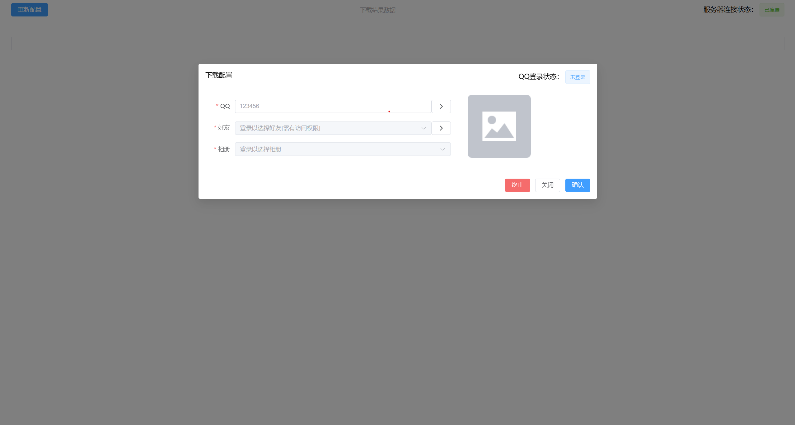

# qq-zone

QQ空间爬虫，下载逻辑来自[qq-zone](https://github.com/qinjintian/qq-zone.git)

#### 前言

QQ相册可以说是存放了好大一部分人生活的点点滴滴，近段时间发现QQ空间莫名会删除短视频或者相片，记得20年的时候也类似新闻报道过，为了快速备份写了此程序，网上看到大部分是使用Python实现的，而且操作过程也都
**比较繁琐**，需要打开网页然后F12复制cookie等必要参数，对于非专业的用户来说这显得复杂，因此我写了一个通过**手机扫描登陆**
即可下载自己或好友的相册相片/视频，极大简化了用户操作流程，人人都会使用，其他功能请留言并关注，我会尽量抽时间补充~~~

#### 介绍

使用GO语言多协程并发式开发的QQ空间爬虫，通过手机QQ扫码登陆后即可全自动下载相册的相片和视频

#### 环境要求

- docker 运行环境

#### 使用说明

1. 把项目下载下来 git clone https://github.com/liheji/qq-zone.git

2. 进入到qq-zone目录

3. 使用 docker 构建项目， 运行`bash build.sh`

4. 运行容器 `docker run --rm --net=host --name=qqzone yilee01/qq-zone`

5. 访问 `http://[主机IP]:9000` 按照图示操作即可

#### 截图

